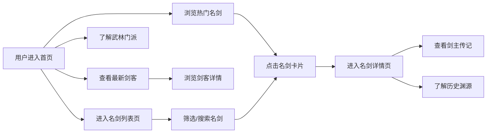

## 1. 产品概述

《江湖名剑谱》是一个展示中国武侠世界名剑、剑客和门派的全栈Web应用。以水墨江湖为设计基调，为用户提供沉浸式的武侠文化体验，收录天下名剑、传奇剑客和武林门派。

- **核心价值**：传承武侠文化，打造精美绝伦的名剑收藏展示平台
- **目标用户**：武侠爱好者、传统文化爱好者、游戏玩家
- **市场定位**：垂直细分的文化展示类应用，兼具艺术性和实用性

## 2. 核心功能

### 2.1 用户角色
| 角色 | 注册方式 | 核心权限 |
|------|----------|----------|
| 游客 | 无需注册 | 浏览名剑、剑客、门派信息 |

### 2.2 功能模块
1. **首页**：水墨风格Hero区域、热门名剑展示、最新收录剑客、武林门派概览
2. **名剑列表页**：名剑筛选、排序、分页浏览、搜索功能
3. **名剑详情页**：名剑详细信息、剑主传记、相关典故、历史渊源

### 2.3 页面详情
| 页面名称 | 模块名称 | 功能描述 |
|----------|----------|----------|
| 首页 | Hero区域 | 水墨动态背景、卷轴展开动画、主题标语展示 |
| 首页 | 热门名剑 | 横向滚动卡片展示、悬停剑影特效、点击跳转详情 |
| 首页 | 最新收录剑客 | 头像+简介卡片、江湖名号展示 |
| 首页 | 武林门派 | 门派徽章、地理位置、武功特色 |
| 名剑列表页 | 筛选排序 | 按朝代、剑主、门派筛选，按人气、年代排序 |
| 名剑列表页 | 名剑卡片 | 水墨边框、剑气光效、悬停浮起动画 |
| 名剑详情页 | 名剑图鉴 | 高清剑图、基本属性面板、360度旋转展示 |
| 名剑详情页 | 剑主传记 | 剑客生平、佩剑故事、相关诗词 |
| 名剑详情页 | 历史渊源 | 名剑来历、铸造工艺、历代传承 |

## 3. 核心流程

## 4. 用户界面设计

### 4.1 设计风格

**水墨江湖主题**：
- **主色调**：墨黑(`#1a1a1a`)、宣纸米白(`#f5f0e6`)、朱砂红(`#c41e3a`)、青铜绿(`#4a6741`)
- **辅助色**：黛青(`#2d3a4a`)、烟灰色(`#8b8680`)、金色(`#d4af37`)
- **按钮风格**：水墨晕染边框、悬停墨色扩散效果、圆角适中
- **字体**：标题使用书法风格字体(如"Ma Shan Zheng")，正文使用"Noto Serif SC"宋体
- **布局风格**：卷轴式布局、留白雅致、不对称构图、层次感丰富
- **装饰元素**：水墨笔触、祥云纹样、印章落款、梅兰竹菊四君子图案

### 4.2 页面设计概述

| 页面名称 | 模块名称 | UI元素 |
|----------|----------|----------|
| 首页 | Hero区域 | 全屏水墨山水背景、卷轴展开动画、大字标题竖排、印章点缀 |
| 首页 | 热门名剑 | 横向滑动画廊、剑影悬浮特效、水墨边框卡片、人气标注 |
| 首页 | 最新剑客 | 圆形头像+墨迹边框、江湖名号书法字体、佩剑缩略图 |
| 首页 | 武林门派 | 六角形门派徽章、地理位置标记、武功特色标签 |
| 名剑列表页 | 筛选栏 | 印章式筛选按钮、下拉式排序菜单、搜索框带毛笔图标 |
| 名剑列表页 | 卡片网格 | 响应式网格布局、卡片悬停浮起+剑气光效、分页器 |
| 名剑详情页 | 名剑图鉴 | 大图展示、属性面板、剑气光环动效 |
| 名剑详情页 | 内容区域 | 竖排标题、段落首字下沉、引用诗词标注、墨迹分隔线 |

### 4.3 响应式

- **设计优先**：桌面端优先设计，适配1920px、1440px、1024px
- **移动端适配**：768px以下单列布局，触摸交互优化，横滑组件
- **断点设置**：`sm:640px`、`md:768px`、`lg:1024px`、`xl:1280px`、`2xl:1536px`

### 4.4 动效设计

- **页面加载**：卷轴从上至下展开，内容渐入
- **卡片悬停**：轻微上浮+墨色晕染+剑气微光
- **滚动效果**：视差滚动，水墨背景层叠移动
- **导航切换**：页面切换如翻页，墨迹过渡
- **交互反馈**：点击产生水墨涟漪效果
