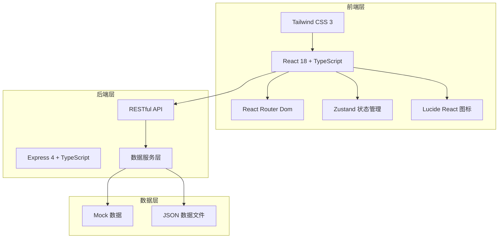
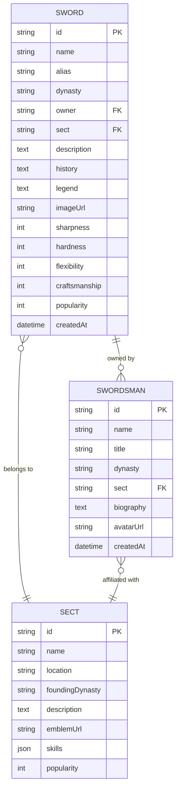

## 1. 架构设计



## 2. 技术描述

- **前端框架**：React@18 + TypeScript + Vite@5
- **UI框架**：Tailwind CSS@3 + 自定义水墨主题
- **路由管理**：React Router Dom@6
- **状态管理**：Zustand@4
- **图标库**：Lucide React@0.294
- **后端框架**：Express@4 + TypeScript
- **构建工具**：Vite@5 + ts-node
- **初始化方式**：vite-init react-express-ts 模板

## 3. 路由定义

| 路由路径 | 页面名称 | 说明 |
|----------|----------|------|
| `/` | 首页 | 热门名剑、剑客、门派展示 |
| `/swords` | 名剑列表页 | 名剑浏览、筛选、搜索 |
| `/swords/:id` | 名剑详情页 | 名剑详细信息展示 |
| `/swordsmen` | 剑客列表页 | 剑客浏览（预留扩展） |
| `/sects` | 门派列表页 | 门派浏览（预留扩展） |

## 4. API 定义

### 4.1 类型定义

```typescript
// 名剑
interface Sword {
  id: string;
  name: string;
  alias: string;
  dynasty: string;
  owner: string;
  sect: string;
  description: string;
  history: string;
  legend: string;
  imageUrl: string;
  attributes: {
    sharpness: number;
    hardness: number;
    flexibility: number;
    craftsmanship: number;
  };
  popularity: number;
  createdAt: string;
}

// 剑客
interface Swordsman {
  id: string;
  name: string;
  title: string;
  dynasty: string;
  sect: string;
  biography: string;
  avatarUrl: string;
  swords: string[];
  createdAt: string;
}

// 门派
interface Sect {
  id: string;
  name: string;
  location: string;
  foundingDynasty: string;
  description: string;
  emblemUrl: string;
  skills: string[];
  notableSwords: string[];
  popularity: number;
}

// API 响应
interface ApiResponse<T> {
  code: number;
  message: string;
  data: T;
}
```

### 4.2 接口列表

| 方法 | 路径 | 描述 | 请求参数 | 返回数据 |
|------|------|------|----------|----------|
| GET | `/api/swords` | 获取名剑列表 | `page`, `limit`, `dynasty`, `sect`, `keyword`, `sortBy` | `{ list: Sword[], total: number }` |
| GET | `/api/swords/popular` | 获取热门名剑 | `limit` | `Sword[]` |
| GET | `/api/swords/:id` | 获取名剑详情 | `id` | `Sword` |
| GET | `/api/swordsmen` | 获取剑客列表 | `limit` | `Swordsman[]` |
| GET | `/api/swordsmen/latest` | 获取最新剑客 | `limit` | `Swordsman[]` |
| GET | `/api/sects` | 获取门派列表 | `limit` | `Sect[]` |
| GET | `/api/sects/popular` | 获取热门门派 | `limit` | `Sect[]` |

## 5. 服务器架构图


## 6. 项目目录结构

```
├── src/                    # 前端源码
│   ├── components/         # 公共组件
│   │   ├── layout/        # 布局组件
│   │   ├── sword/         # 名剑相关组件
│   │   ├── swordsman/     # 剑客相关组件
│   │   └── sect/          # 门派相关组件
│   ├── pages/             # 页面组件
│   │   ├── Home.tsx
│   │   ├── SwordList.tsx
│   │   └── SwordDetail.tsx
│   ├── hooks/             # 自定义 Hooks
│   ├── store/             # Zustand 状态管理
│   ├── utils/             # 工具函数
│   ├── types/             # TypeScript 类型定义
│   ├── App.tsx
│   ├── main.tsx
│   └── index.css
├── api/                   # 后端源码
│   ├── src/
│   │   ├── routes/        # 路由定义
│   │   ├── controllers/   # 控制器
│   │   ├── services/      # 业务逻辑
│   │   └── data/          # Mock 数据
│   └── index.ts
├── shared/                # 共享类型定义
├── vite.config.ts
├── tailwind.config.js
├── tsconfig.json
└── package.json
```

## 7. 数据模型

### 7.1 ER 图



### 7.2 初始化数据

项目启动时自动加载 Mock 数据，包含：
- 12 把传世名剑（轩辕剑、湛泸、赤霄、太阿等）
- 8 位传奇剑客
- 6 大门派数据
